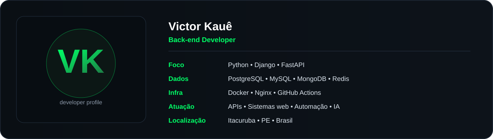
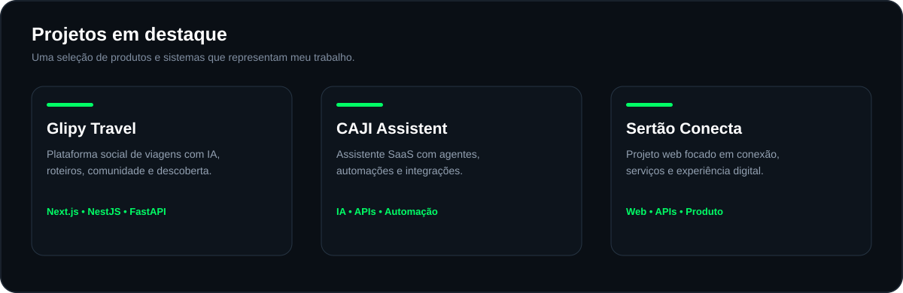

 

 

## Sobre mim

Desenvolvedor **back-end** com foco em **Python, Django e FastAPI**, construindo sistemas web, APIs REST e aplicações administrativas para problemas reais de negócio.

- Criação de **APIs REST** com **Django e FastAPI**;
- **Docker e CI/CD com GitHub Actions**, com deploy em **Gunicorn e Nginx**;
- Modelagem e integração de bancos: **PostgreSQL, MySQL, MongoDB e Redis**;
- Desenvolvimento com **React, Next.js, TypeScript e Tailwind CSS** quando o projeto exige;
- **Automação com Python**, bots, integrações com IA e processamento de dados.

 

## Perfil

 

## Stack principal

  

### Também trabalho com

  
    
  
    
  

 

## Projetos em destaque

 

## Atividade no GitHub

<picture>
  <source media="(prefers-color-scheme: dark)" srcset="https://raw.githubusercontent.com/Victorkaue333/Victorkaue333/output/github-contribution-grid-snake-dark.svg" />
  <source media="(prefers-color-scheme: light)" srcset="https://raw.githubusercontent.com/Victorkaue333/Victorkaue333/output/github-contribution-grid-snake.svg" />
  
</picture>

 

## Estatísticas GitHub

 

## Contato

 

---

*"Faça o teu melhor, na condição que você tem, enquanto você não tem condições melhores para fazer melhor ainda!"*

**— Mario Sergio Cortella**

 

