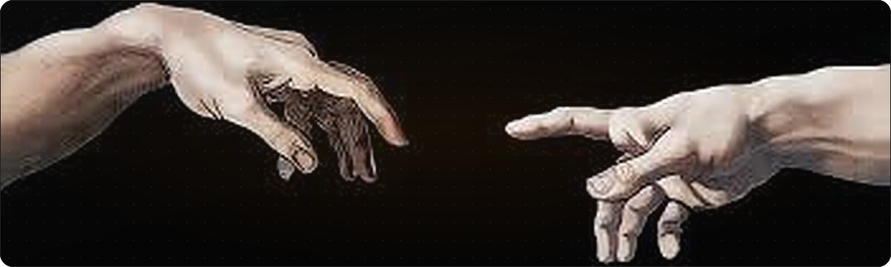
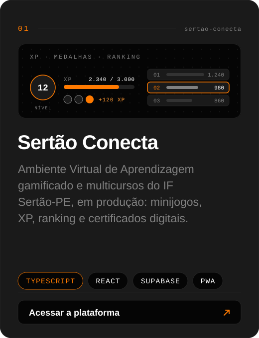
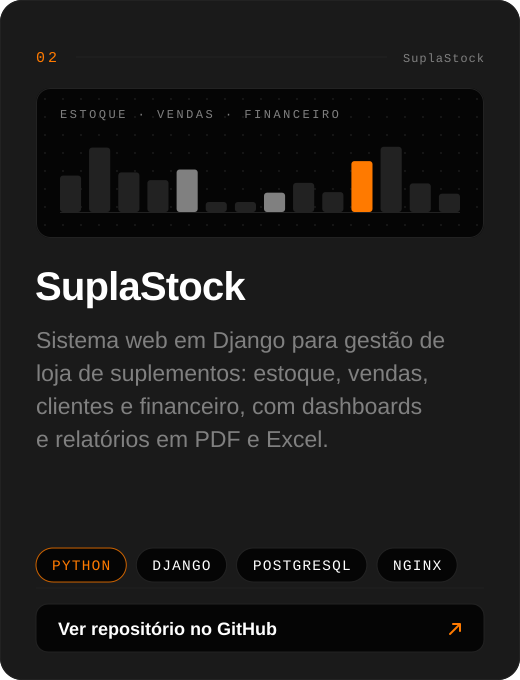
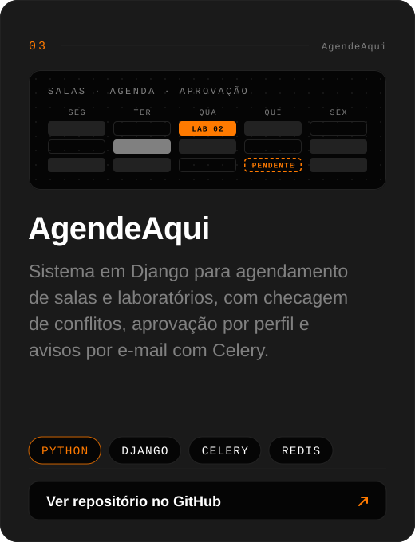
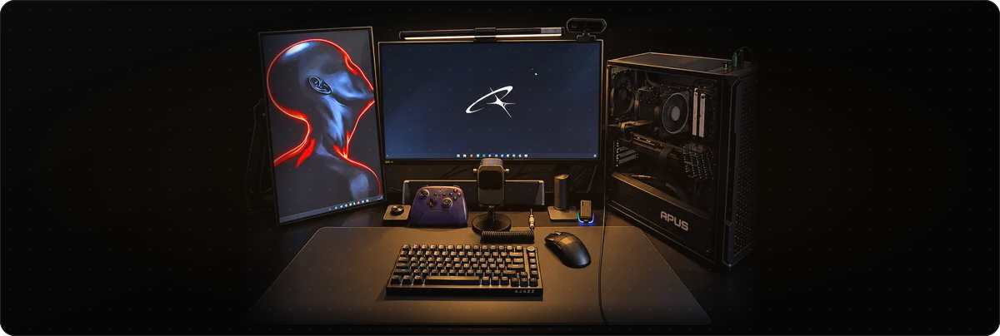

  

<!-- retrato ASCII (digita linha a linha) + wordmark 3D em ASCII (balança): python scripts/whoami.py -->

<h3><code>victor@github ~ $ whoami</code></h3>

<table>
  <tr>
    <td valign="top"></td>
    <td valign="top"></td>
  </tr>
</table>

Sou desenvolvedor **Full Stack** com foco em **backend e sistemas web**. Sou formado em Desenvolvimento de Sistemas e estou me graduando em Gestão da Tecnologia da Informação no IF Sertão-PE. Trabalho com APIs, regras de negócio, modelagem de dados, interface web e deploy, com atenção a arquitetura limpa, segurança e valor de negócio.

- **Backend**: regras de negócio consistentes, autenticação segura e modelagem de dados pensada para escalar.
- **APIs**: APIs REST com foco em performance, integração e manutenção de longo prazo.
- **Sistemas empresariais**: entrega de ponta a ponta, do planejamento ao deploy em produção com Docker, Nginx, Gunicorn e GitHub Actions.

11 projetos publicados · 10 empresas e instituições · Itacuruba, PE

  

  

  
    
  
    
    

  
  
  

  

  
  

 

  <em>"Faça o teu melhor, na condição que você tem, enquanto você não tem condições melhores para fazer melhor ainda!"</em>
    
  — Mario Sergio Cortella

  

